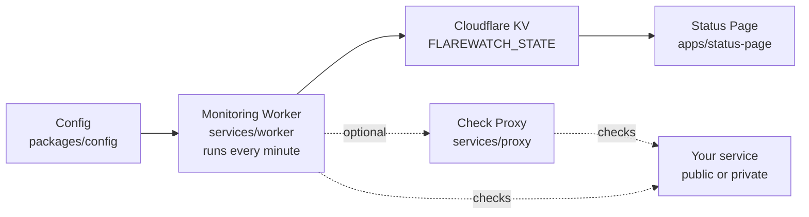

<p align="center">
  
</p>

# FlareWatch

<p align="center">
  
  
  
</p>

<p align="center">
  <a href="https://demo.flarewatch.app">Live demo</a> · <a href="#quick-start">Quick start</a> · <a href="#how-it-works">How it works</a> · <a href="#docs">Docs</a>
</p>

Cloudflare-first uptime monitoring + status page you can fork and self-host.

Live demo (upstream): https://demo.flarewatch.app

## ELI5

- You define monitors (what to check) in `packages/config`.
- A Cloudflare Worker runs every minute, checks them, and stores results in Cloudflare KV.
- The status page (also a Cloudflare Worker) reads KV and renders a public dashboard.
- Optional: run checks through a self-hosted proxy for private networks / TCP / SSL.



## What’s included

- 1-minute cron checks on Cloudflare Workers
- Public status page UI + JSON/SVG APIs
- Uptime history + latency charts
- Scheduled maintenance announcements (managed in `/admin`)
- Webhook notifications (Slack/Discord/Telegram/templates)
- Optional self-hosted check proxy (private networks, TCP, SSL)

## Quick start

1. Fork (or “Use this template”) and enable GitHub Actions.
2. Add the required GitHub Secrets (see `infra/README.md` for exact permissions and where to create them):
   - `CLOUDFLARE_ACCOUNT_ID`
   - `CLOUDFLARE_API_TOKEN`
   - `R2_ACCESS_KEY_ID` / `R2_SECRET_ACCESS_KEY`
   - `PULUMI_CONFIG_PASSPHRASE`
   - Create `CLOUDFLARE_API_TOKEN` with permissions for Workers scripts, Workers KV, and Workers Cron Triggers (plus R2 bucket create if you want CI to bootstrap the Pulumi state bucket).
3. Edit your config:
   - Monitoring: `packages/config/src/worker.ts`
   - Status page: `packages/config/src/public.ts`
4. Push to `main` → the `Deploy to Cloudflare` workflow builds and deploys everything via Pulumi.
5. Find your status page URL:
   - If you configured `customDomain`, it’s `https://<customDomain>`.
   - Otherwise it’s on `workers.dev`: `https://<projectName>.<your-workers-subdomain>.workers.dev` (Cloudflare Dashboard → Workers & Pages → Overview).

The repo ships with safe demo monitors, so a fresh deploy shows a working page immediately.

Optional GitHub Secrets (only if you use these features):

- `FLAREWATCH_ADMIN_BASIC_AUTH` — protects `/admin` and `/api/admin/*` (`<username>:<password>`)
- `FLAREWATCH_STATUS_PAGE_BASIC_AUTH` — protects the whole site (`<username>:<password>`)
- `FLAREWATCH_PROXY_TOKEN` — bearer token for authenticating to a check proxy

## How it works

- `services/worker` runs scheduled checks and writes `state` to the `FLAREWATCH_STATE` KV namespace.
- `apps/status-page` reads that same KV namespace and serves the UI + `/api/*` endpoints.
- `services/proxy` is optional and executes checks from custom locations (private networks, TCP, SSL).
  - If “where the check runs” matters (latency/region), use the proxy.
- Optional: set a `CONFIG_KV` binding with a runtime config blob (see `packages/shared/src/config.ts`) to update monitors and status page branding without redeploying. When unset, the worker falls back to the static config in `packages/config`.

## Example monitor

```ts
// packages/config/src/worker.ts
export const workerConfig = {
  monitors: [{ id: 'api', name: 'API', method: 'GET', target: 'https://example.com/health' }],
};
```

```ts
// packages/config/src/public.ts
export const pageConfig = {
  title: 'My Status Page',
  group: { Services: ['api'] },
};
```

## Docs

- [DEVELOPMENT.md](DEVELOPMENT.md) — local dev commands + repo structure
- [infra/README.md](infra/README.md) — Pulumi (long-lived resources) + R2 backend
- [apps/status-page/README.md](apps/status-page/README.md) — status page Worker, APIs, auth, local testing
- [services/worker/README.md](services/worker/README.md) — monitoring Worker, cron, KV state
- [services/proxy/README.md](services/proxy/README.md) — optional self-hosted check proxy
- [CONTRIBUTING.md](CONTRIBUTING.md) — how to contribute
- [SECURITY.md](SECURITY.md) — security policy
- [CODE_OF_CONDUCT.md](CODE_OF_CONDUCT.md) — community guidelines

## License

MIT — see [LICENSE](LICENSE).
