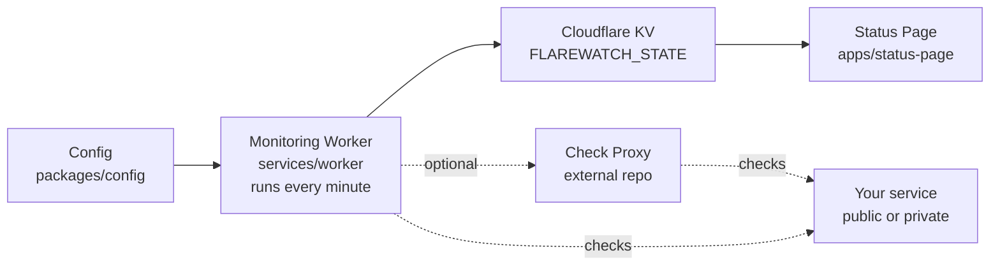

<p align="center">
  
</p>

# FlareWatch

<p align="center">
  
  
  
</p>

<p align="center">
  <a href="https://demo.flarewatch.app">Live demo</a> | <a href="#quick-start">Quick start</a> | <a href="#how-it-works">How it works</a> | <a href="#docs">Docs</a>
</p>

Cloudflare-first uptime monitoring and a status page you can fork and self-host.

Live demo (upstream): https://demo.flarewatch.app

## ELI5

- You define monitors (what to check) in `packages/config`.
- A Cloudflare Worker runs every minute, checks them, and stores results in Cloudflare KV.
- The status page (also a Cloudflare Worker) reads KV and renders a public dashboard.
- Optional: run checks through a check proxy for private networks / TCP / SSL.


```mermaid
flowchart LR
  Config["Config<br/>packages/config"] --> Worker["Monitoring Worker<br/>services/worker<br/>runs every minute"]
  Worker --> KV["Cloudflare KV<br/>FLAREWATCH_STATE"]
  KV --> Page["Status Page<br/>apps/status-page"]

  Worker -. optional .-> Proxy["Check Proxy<br/>external repo"]
  Proxy -. checks .-> Target["Your service<br/>public or private"]
  Worker -. checks .-> Target
```

## What's included

- 1-minute cron checks on Cloudflare Workers
- Public status page UI and JSON/SVG APIs
- Uptime history and latency charts
- Scheduled maintenance announcements (configured in `/admin`)
- Webhook notifications (Slack/Discord/Telegram/templates)
- Optional check proxy support (private networks, TCP, SSL)

## Quick start

1. Fork the repo, or use it as a template, and enable GitHub Actions.
2. Add the required GitHub Secrets. See `infra/README.md` for permissions and where to create them.
   - `CLOUDFLARE_ACCOUNT_ID`
   - `CLOUDFLARE_API_TOKEN`
   - `R2_ACCESS_KEY_ID` / `R2_SECRET_ACCESS_KEY`
   - `PULUMI_CONFIG_PASSPHRASE`
   - Create `CLOUDFLARE_API_TOKEN` with permissions for Workers scripts, Workers KV, and Workers Cron Triggers. Add R2 bucket create permission if CI should bootstrap the Pulumi state bucket.
3. Edit your config:
   - Monitoring: `packages/config/src/worker.ts`
   - Status page: `packages/config/src/public.ts`
4. Push to `main`. The `Deploy to Cloudflare` workflow builds and deploys everything via Pulumi.
5. Find your status page URL:
   - If you configured `customDomain`, use `https://<customDomain>`.
   - Otherwise, use `https://<projectName>.<your-workers-subdomain>.workers.dev`. Find the subdomain in Cloudflare Dashboard > Workers & Pages > Overview.

The repo ships with safe demo monitors, so a fresh deploy shows a working page immediately.

Optional GitHub Secrets:

- `FLAREWATCH_ADMIN_BASIC_AUTH` - protects `/admin` and `/api/admin/*`
- `FLAREWATCH_STATUS_PAGE_BASIC_AUTH` - protects the whole site
- `FLAREWATCH_PROXY_TOKEN` - bearer token for a check proxy

Generate an auth secret payload from a username and password:

```bash
pnpm auth:secret -- <username> 'replace-with-strong-password'
```

Run it once per secret and paste the full JSON output into the matching GitHub Secret value:

- output for the admin login username => `FLAREWATCH_ADMIN_BASIC_AUTH`
- output for the status-page username => `FLAREWATCH_STATUS_PAGE_BASIC_AUTH`

Do not manually construct or edit JSON fields.

## How it works

- `services/worker` runs scheduled checks and writes `state` to the `FLAREWATCH_STATE` KV namespace.
- `apps/status-page` reads that same KV namespace and serves the UI + `/api/*` endpoints.
- The optional check proxy lives in a separate repo: https://github.com/saminnet/flarewatch-proxy
  - It runs checks from custom locations (private networks, TCP, SSL).
  - If where the check runs matters (latency/region), use the proxy.
  - By default, proxy failures mark the check as failed. Set `checkProxyFallback: true` on a monitor to fall back to a direct check after the proxy fails.
- Optional: set a `CONFIG_KV` binding with runtime config JSON. It can be the config object itself or an envelope like `{ "config": { ... } }`; extra envelope fields are ignored. If unset, FlareWatch uses the static config in `packages/config`.

## Example monitor

```ts
// packages/config/src/worker.ts
export const workerConfig = {
  monitors: [{ id: 'api', name: 'API', method: 'GET', target: 'https://example.com/health' }],
};
```

```ts
// packages/config/src/public.ts
export const pageConfig = {
  title: 'My Status Page',
  group: { Services: ['api'] },
};
```

## Docs

- Development uses Vite+: `vp install`, `vp check`, `vp run test`, `vp run build`, and `vp config` for local hooks.
- [DEVELOPMENT.md](DEVELOPMENT.md) - local dev commands and repo structure
- [infra/README.md](infra/README.md) - Pulumi resources and R2 backend
- [apps/status-page/README.md](apps/status-page/README.md) - status page Worker, APIs, auth, local testing
- [services/worker/README.md](services/worker/README.md) - monitoring Worker, cron, KV state
- [flarewatch-proxy repo](https://github.com/saminnet/flarewatch-proxy) - optional check proxy
- [CONTRIBUTING.md](CONTRIBUTING.md) - how to contribute
- [SECURITY.md](SECURITY.md) - security policy
- [CODE_OF_CONDUCT.md](CODE_OF_CONDUCT.md) - community guidelines

## License

MIT. See [LICENSE](LICENSE).
