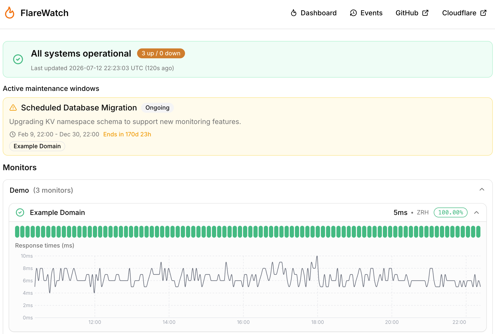
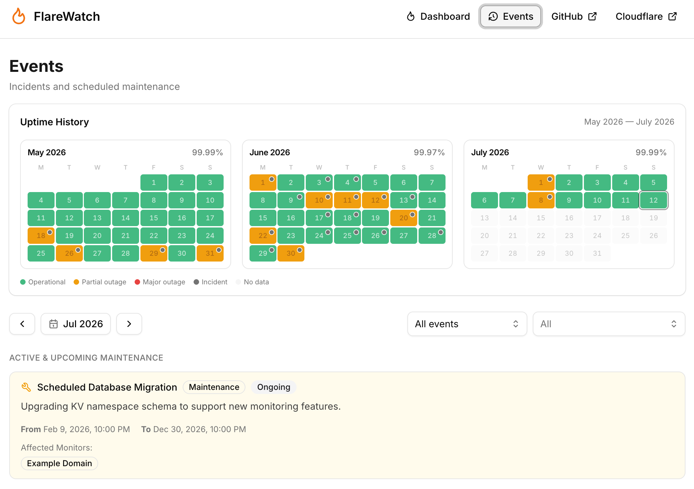
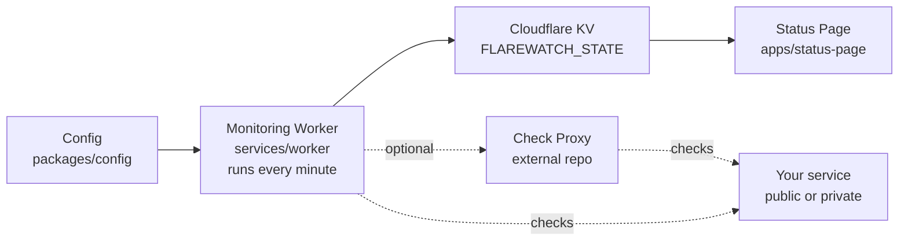

<p align="center">
  
</p>

# FlareWatch

<p align="center">
  <a href="https://github.com/saminnet/flarewatch/actions/workflows/deploy.yml"></a>
  
  
  
</p>

<p align="center">
  <a href="https://demo.flarewatch.app"><strong>Live demo</strong></a> | <a href="#deploy-in-10-minutes">Deploy in ~10 minutes</a> | <a href="#features">Features</a> | <a href="#what-does-it-cost">Cost</a>
</p>

<picture>
  <source media="(prefers-color-scheme: dark)" srcset="docs/assets/status-page-dark.png" />
  
</picture>

**Free uptime monitoring on Cloudflare. No server, no Docker, no monthly bill.**

FlareWatch is a serverless status page and uptime monitor that runs entirely on
Cloudflare's free tier and deploys into your own Cloudflare account. Fork it,
add two GitHub secrets, edit your config, and push to `main`. Your checks run
every minute from Cloudflare's edge, and your public status page is served by
Cloudflare Workers.

Live demo: <https://demo.flarewatch.app>

## Why FlareWatch

- Runs in your Cloudflare account, not on a hosted SaaS you have to trust.
- Uses Workers, KV, and Cron Triggers; no VM, container, database, or 24/7 host.
- Checks every minute from the edge. Upptime is limited by GitHub Actions cron
  timing, and Uptime Kuma/Gatus still need somewhere always on to run.
- Set up in minutes: fork, two secrets, config, push.

## Features

- 1-minute scheduled checks with Cloudflare Cron Triggers.
- HTTP checks with status code, response keyword, headers, body, and timeout
  validation.
- TCP port checks from Workers and ICMP/TCP ping checks from proxy or
  Globalping-backed locations.
- SSL certificate expiry monitoring on proxy/Globalping-backed HTTPS checks,
  with configurable warning thresholds.
- Multi-region checks through Globalping integration.
- Slack, Discord, Telegram, ntfy, and custom webhook notifications.
- Incident history, latency history, uptime percentages, and uptime calendar.
- Scheduled maintenance windows managed from the `/admin` UI.
- Embeddable SVG badges and per-monitor status widgets.
- Public JSON APIs for status and maintenance data.
- Light/dark mode, theme tokens, custom CSS, and optional custom domains.
- Optional proxy support for private networks and custom check locations:
  <https://github.com/saminnet/flarewatch-proxy>.



## ELI5

- You define monitors in `packages/config`.
- A Cloudflare Worker runs every minute, checks them, and stores results in
  Cloudflare KV.
- The status page, also a Cloudflare Worker, reads KV and renders a public
  dashboard.
- Optional: route checks through Globalping or a check proxy for private
  networks, TCP/ICMP checks, SSL metadata, or custom locations.


```mermaid
flowchart LR
  Config["Config<br/>packages/config"] --> Worker["Monitoring Worker<br/>services/worker<br/>runs every minute"]
  Worker --> KV["Cloudflare KV<br/>FLAREWATCH_STATE"]
  KV --> Page["Status Page<br/>apps/status-page"]

  Worker -. optional .-> Proxy["Check Proxy<br/>external repo"]
  Proxy -. checks .-> Target["Your service<br/>public or private"]
  Worker -. checks .-> Target
```

## What does it cost?

Expected cost for a typical personal or small-team status page: **$0/month**.

| Piece         | Cloudflare free tier                      | FlareWatch use                                                | Honest limit                                                                                     |
| ------------- | ----------------------------------------- | ------------------------------------------------------------- | ------------------------------------------------------------------------------------------------ |
| Workers       | 100,000 requests/day                      | Two Workers: monitor runner and status page                   | Heavy public traffic can exhaust the daily request limit.                                        |
| Cron Triggers | 5 triggers/account                        | One trigger: `* * * * *`                                      | FlareWatch uses one of the five free triggers.                                                   |
| Workers KV    | 100,000 reads/day, 1,000 writes/day, 1 GB | Shared `flarewatch-state` namespace for status and admin data | State writes are cooled down to 3 minutes by default; very flappy setups can exceed free writes. |

Optional services can have their own limits: GitHub Actions runs your deploy
workflow, Globalping may require its own token, and a private proxy is something
you host separately if you need private-network checks.

Cloudflare references: [Workers limits](https://developers.cloudflare.com/workers/platform/limits/),
[KV limits](https://developers.cloudflare.com/kv/platform/limits/), and
[Cron Triggers](https://developers.cloudflare.com/workers/configuration/cron-triggers/).

## Deploy in ~10 minutes

This is the canonical self-host path:

`fork -> add 2 GitHub secrets -> edit config -> push to main`

### 1. Fork the repo

Fork <https://github.com/saminnet/flarewatch> into your own GitHub account or
organization. Keep GitHub Actions enabled on the fork.

### 2. Create a Cloudflare API token

In Cloudflare:

1. Open the dashboard and select the account where FlareWatch should live.
2. Go to **My Profile -> API Tokens -> Create Token -> Custom token**.
3. Add these permission groups:

| Resource | Permission group   | Level |
| -------- | ------------------ | ----- |
| Account  | Workers Scripts    | Edit  |
| Account  | Workers KV Storage | Edit  |
| Account  | Account Settings   | Read  |
| User     | User Details       | Read  |
| User     | Memberships        | Read  |

Scope account resources to the single Cloudflare account you will deploy into.
For the default `workers.dev` URL, no zone permission is required. If you later
uncomment a custom-domain route in `apps/status-page/wrangler.jsonc`, add
`Zone -> Workers Routes -> Edit` for that zone.

The Cloudflare **Edit Cloudflare Workers** template is also fine if you scope it
to your account. It includes the required Workers/KV/account permissions and a
few extra Workers-related permissions.

Create the token and copy it once. Do not commit it.

### 3. Find your Cloudflare account ID

In Cloudflare, go to **Workers & Pages**. The **Account details** panel shows
your Account ID. Cloudflare also exposes it from the Account home row menu as
**Copy account ID**.

### 4. Add the two GitHub secrets

In your fork, go to **Settings -> Secrets and variables -> Actions -> New
repository secret** and add:

- `CLOUDFLARE_ACCOUNT_ID` - the account ID from Cloudflare.
- `CLOUDFLARE_API_TOKEN` - the token you created above.

Optional secrets:

- `FLAREWATCH_ADMIN_BASIC_AUTH` - protects `/admin` and `/api/admin/*`.
- `FLAREWATCH_STATUS_PAGE_BASIC_AUTH` - protects the whole site.
- `FLAREWATCH_PROXY_TOKEN` - bearer token for a check proxy.

Generate auth secret payloads from a username and password:

```bash
vp run auth:secret -- <username> 'replace-with-strong-password'
```

Run it once per secret and paste the full JSON output into the matching GitHub
secret value. Do not manually construct or edit the JSON fields.

### 5. Edit your config

Edit these files in your fork:

- `packages/config/src/worker.ts` - monitors, timeouts, notifications, proxy,
  Globalping, SSL expiry thresholds.
- `packages/config/src/public.ts` - page title, links, groups, CORS, theming.

The repo ships with safe demo monitors so a fresh deploy shows a working status
page immediately. Replace them before relying on FlareWatch for real alerting.

### 6. Push to `main`

Push your config changes to `main`. The `CI and Deploy` workflow will:

1. Run `vp check`, unit tests, browser tests, and builds.
2. Create or adopt the `flarewatch-state` KV namespace.
3. Inject that KV namespace ID into both Wrangler configs.
4. Deploy `flarewatch-worker`.
5. Build and deploy the `flarewatch` status page Worker.

When it finishes, open the workflow run summary in GitHub Actions. The
`Deploy to Cloudflare` job writes the final status page URL there. By default it
looks like:

```text
https://flarewatch.<your-workers-dev-subdomain>.workers.dev
```

## FlareWatch vs alternatives

| Project     | Difference                                                                      |
| ----------- | ------------------------------------------------------------------------------- |
| Uptime Kuma | Full-featured and popular, but it needs an always-on host.                      |
| Upptime     | GitHub Actions based, unmaintained, and generally limited to ~5-min cron.       |
| Gatus       | Great YAML/GitOps monitor, but it still needs a host to run continuously.       |
| FlareWatch  | Runs on Cloudflare's free serverless primitives in your own Cloudflare account. |

## How it works

- `services/worker` runs scheduled checks and writes `state` to the
  `FLAREWATCH_STATE` KV namespace.
- `apps/status-page` reads that same KV namespace and serves the UI plus
  `/api/*` endpoints.
- The deploy workflow creates/adopts one shared KV namespace named
  `flarewatch-state` and injects its ID into both Wrangler configs.
- Optional: set a `CONFIG_KV` binding with runtime config JSON. It can be the
  config object itself or an envelope like `{ "config": { ... } }`; extra
  envelope fields are ignored. If unset, FlareWatch uses the static config in
  `packages/config`.
- Optional: use the external check proxy for private networks and custom check
  locations. By default, proxy failures mark the check as failed. Set
  `checkProxyFallback: true` on a monitor to fall back to a direct check after
  the proxy fails.
- A monitor for a site in the same zone as the monitoring Worker also needs the
  check proxy. Cloudflare sends a Worker's same-zone fetches straight to the
  origin, so a direct check fails with a 503 even when the site is up.

## Example monitor

```ts
// packages/config/src/worker.ts
export const workerConfig = {
  monitors: [{ id: 'api', name: 'API', method: 'GET', target: 'https://example.com/health' }],
};
```

```ts
// packages/config/src/public.ts
export const pageConfig = {
  title: 'My Status Page',
  group: { Services: ['api'] },
};
```

## Docs

- Development uses Vite+: `vp install`, `vp check`, `vp run test`,
  `vp run build`, and `vp config` for local hooks.
- [DEVELOPMENT.md](DEVELOPMENT.md) - local dev commands and repo structure
- [apps/status-page/README.md](apps/status-page/README.md) - status page
  Worker, APIs, auth, local testing
- [services/worker/README.md](services/worker/README.md) - monitoring Worker,
  cron, KV state
- [flarewatch-proxy repo](https://github.com/saminnet/flarewatch-proxy) -
  optional check proxy
- [CONTRIBUTING.md](CONTRIBUTING.md) - how to contribute
- [SECURITY.md](SECURITY.md) - security policy
- [CODE_OF_CONDUCT.md](CODE_OF_CONDUCT.md) - community guidelines

## License

MIT. See [LICENSE](LICENSE).
